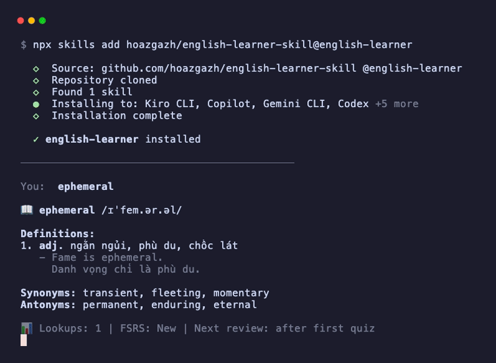

# 🧠 English Learner — AI Vocabulary Skill with FSRS Spaced Repetition

> Turn your AI coding agent into a personal English tutor — with Anki-grade spaced repetition built in.

[](LICENSE)
[](https://nodejs.org)
[](https://github.com/open-spaced-repetition/ts-fsrs)
[](https://skills.sh)
[](#supported-agents)

Look up words, get quizzed, and master vocabulary — all inside your AI agent chat.



## Quick Start

```bash
npx skills add hoazgazh/english-learner-skill@english-learner
```

That's it. Start chatting with your agent — the skill activates automatically.

## Why This Skill?

- ✅ **Zero context switching** — learn vocabulary while you code, no separate app needed
- ✅ **FSRS spaced repetition** — same algorithm as Anki 23.10+, scientifically optimized intervals
- ✅ **Auto grammar correction** — gentle English tips before answering your actual question
- ✅ **Works across 8+ AI agents** — Kiro, Claude Code, Copilot, Gemini CLI, Codex, and more
- ✅ **100% local** — no cloud, no accounts, your data stays on your machine

## Supported Agents

Installed via [`npx skills`](https://skills.sh) — one command, works everywhere:

| Agent | Status |
|-------|--------|
| **Kiro CLI** | ✅ Stable |
| **Claude Code** | ✅ Stable |
| **GitHub Copilot** | ✅ Stable |
| **Gemini CLI** | ✅ Stable |
| **Codex** | ✅ Stable |
| **Cursor** | ✅ Stable |
| **Windsurf** | ✅ Stable |
| **Warp** | ✅ Stable |

## Features

### 🔤 Word & Phrase Lookup

Type any English word or phrase → get definitions, phonetics, examples, synonyms, and antonyms — saved automatically to your vocabulary bank.

```
You:  ephemeral

📖 ephemeral /ɪˈfem.ər.əl/
1. adj. lasting for a very short time
   - Fame is ephemeral.
Synonyms: transient, fleeting, momentary

📊 Lookups: 1 | FSRS: New | Next review: after first quiz
```

### 🧠 Quiz with FSRS

The same algorithm powering [Anki 23.10+](https://github.com/open-spaced-repetition/ts-fsrs). Words are scheduled for review at optimal intervals based on your recall.

```
You:  quiz

📖 diligent /ˈdɪl.ə.dʒənt/
> "She is a diligent worker."
Do you remember the meaning?

You:  hardworking

✅ Correct! adj. showing care and effort in work
🔄 FSRS: Good → Next review: 2 days | Stability: 3.2d
```

| Command | What it does |
|---------|-------------|
| `quiz` | Quiz due words (FSRS-scheduled) |
| `quiz new` | Quiz unlearned words |
| `quiz hard` | Quiz difficult words |
| `quiz random` | Random quiz from all words |
| `review` | See what's due for review |
| `stats` | View learning statistics |

### ✍️ Auto Grammar Correction

Write English with mistakes — the skill gently corrects you before answering your question.

```
You:  I have went to the store yesterday.

💡 English Tip:
| Your Expression | Better Expression | Why |
|----------------|-------------------|-----|
| have went | went | Simple past for specific past time |

(continues with your actual task...)
```

### 📊 Progress Tracking

```
You:  stats

📊 Learning Statistics
| Category         | Count |
|-----------------|-------|
| Total vocabulary | 414   |
| Due now          | 12    |
| Learning         | 22    |
| Mature (≥21d)   | 2     |
```

## How FSRS Works

| State | Meaning | Intervals |
|-------|---------|-----------|
| New | Never reviewed | — |
| Learning | Just started | Minutes → hours |
| Review | Known | Days → weeks → months |
| Relearning | Forgot | Back to short intervals |

After each quiz, you're graded: **Again** (forgot) → **Hard** → **Good** → **Easy** (instant recall). Each rating adjusts the next review interval using the FSRS algorithm.

## Installation

### Option 1: npx skills (recommended)

```bash
npx skills add hoazgazh/english-learner-skill@english-learner
```

### Option 2: Manual

```bash
git clone https://github.com/hoazgazh/english-learner-skill.git
cp -r english-learner-skill/english-learner .kiro/skills/
cd .kiro/skills/english-learner/scripts && npm install
```

### Requirements

- Node.js ≥ 18
- Any [supported AI agent](#supported-agents)

## Data Storage

All data stored locally at `~/.english-learner/`:

```
~/.english-learner/
├── words/        # Vocabulary by prefix (ab.json, co.json, ...)
├── phrases/      # Idioms & phrases
└── history/      # Daily lookup history
```

No cloud. No accounts. No tracking.

## How It Works

```
Chat message
    ↓
Auto-detect grammar issues? → Show English Tip
    ↓
Classify: word / phrase / sentence / quiz command
    ↓
Look up existing vocabulary → AI generates definitions
    ↓
Save to local vocabulary bank → Show FSRS stats
```

## Contributing

Contributions welcome! See [CONTRIBUTING.md](CONTRIBUTING.md) for guidelines.

## Acknowledgments

- [ts-fsrs](https://github.com/open-spaced-repetition/ts-fsrs) — TypeScript FSRS implementation
- [Open Spaced Repetition](https://github.com/open-spaced-repetition) — The FSRS algorithm community
- [Kiro](https://kiro.dev) — AI-powered IDE

## License

MIT © [hoazgazh](https://github.com/hoazgazh)
